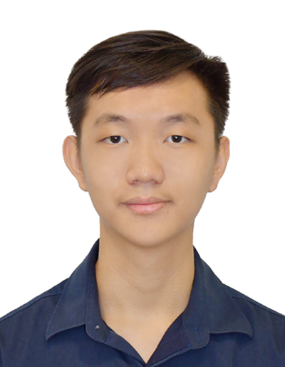
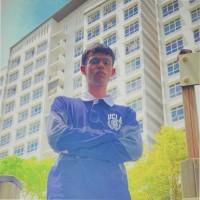

We are a team based in the [School of Computing, National University of Singapore](https://www.comp.nus.edu.sg).

You can reach us at the email `seer[at]comp.nus.edu.sg`

## Project team

### Ho Boon How

[[github](https://github.com/BoonHow97)]

* Role: Student Developer
* Responsibilities: Feature implementation, testing, and documentation

### Prakash

[[github](https://github.com/chocoHacks33)]

* Role: Developer
* Responsibilities: DevOps, continuous integration, testing, and documentation

### Johnny Doe

[[github](http://github.com/johndoe)] [[portfolio](team/johndoe.md)]

* Role: Developer
* Responsibilities: Data

### Alfred

[[github](https://github.com/Alfred051201)]

* Role: Developer
* Responsibilities: Logic, command parsing, use cases, and documentation

### James Doe

[[github](http://github.com/johndoe)]
[[portfolio](team/johndoe.md)]

* Role: Developer
* Responsibilities: UI
