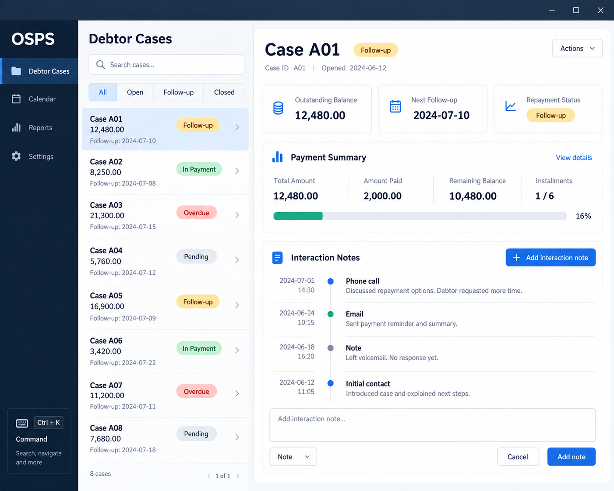

**Orchestration and Scheduling of Payment Scheme (OSPS) is a planned desktop application for debt recovery agents to manage debtor details, outstanding balances, and interaction histories.** It is designed to combine a graphical interface with a command-line interface so users can manage debtor cases efficiently using the keyboard.

* If you are interested in using OSPS, head over to the [_Quick Start_ section of the **User Guide**](UserGuide.html#quick-start).
* If you are interested in developing OSPS, the [**Developer Guide**](DeveloperGuide.html) is a good place to start.

**Acknowledgements**

* OSPS is based on the AddressBook-Level3 project created by the [SE-EDU initiative](https://se-education.org).
* Libraries used: [JavaFX](https://openjfx.io/), [Jackson](https://github.com/FasterXML/jackson), [JUnit5](https://github.com/junit-team/junit5)
